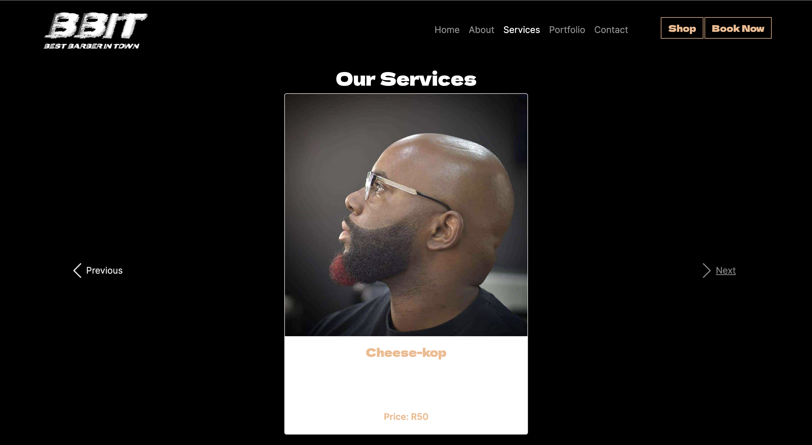

# BBIT-website
Crafting digital identity for Cape Town based barber BBIT
# Project Name: BBIT Barber Shop

## Overview

Welcome to the BBIT Barber Shop project repository. This project aims to create a static website for a barber shop based in Cape Town, South Africa. The website utilizes HTML, CSS, JavaScript, and Bootstrap to provide a responsive and visually appealing platform for showcasing the barber shop's services and facilitating customer interaction.

## Features

1. **Responsive Design**: The website layout adjusts dynamically to different screen sizes, ensuring a consistent user experience across devices.

2. **Smooth Scroll**: Implemented smooth scrolling functionality enhances the user experience by seamlessly transitioning between sections of the website.

3. **Carousel for Cuts/Hairstyle Prices**: Utilizes a carousel component to display a selection of cuts and hairstyle prices, allowing users to browse through offerings easily.

4. **Embedded Google Location**: Integrates Google Maps to provide users with the barber shop's location, simplifying navigation for potential customers.

5. **Takealot Store Integration**: Incorporates links to the barber shop's products and services on the Takealot online store, enabling customers to make purchases conveniently.

6. **WhatsApp Bookings**: Enables customers to book appointments directly through WhatsApp, streamlining the booking process and improving accessibility.

# BBIT-website Image Display

In this documentation, you will find images representing each page of the BBIT website.

## Home Page

This image showcases the home page of the BBIT website, featuring the barber shop's branding and introductory content with picture of the barber & he's clients.

## About Page

This image displays the about page of the BBIT website, providing information about the barber shop and its team.(Disclaimer:the black & white img is of our Model)

## Services Page

Here, you can see the services page of the BBIT website, highlighting the various services offered by the barber shop. This has a carasel feature for clients to browse through what service they need and get a price quote 

## working hours & Portfolio Page

Lastly, this image shows the contact page of the BBIT website, providing watsapp contact information for users to reach out to the barber shop and schedule apointment

## Contact & Location Page

This image represents the location page of the BBIT website, featuring a map embedded from Google Maps to help users locate the barber shop.

